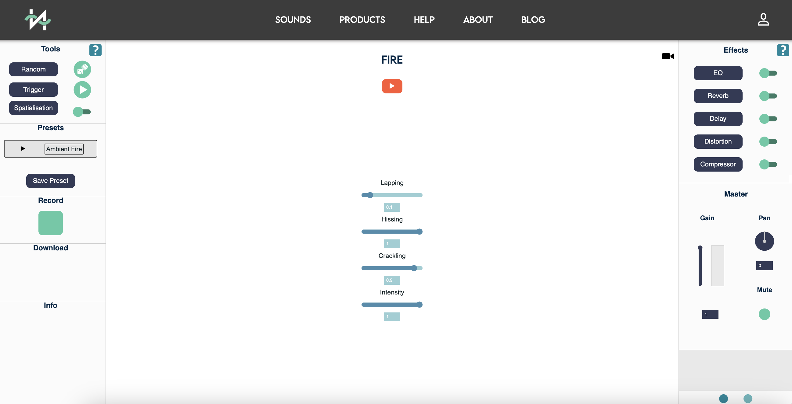
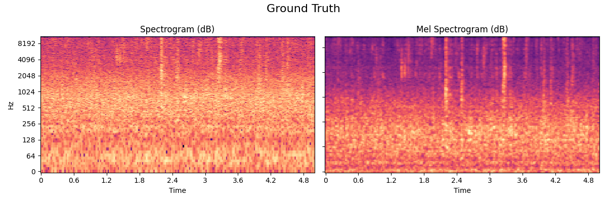
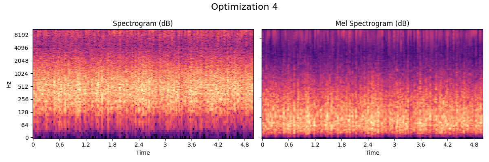
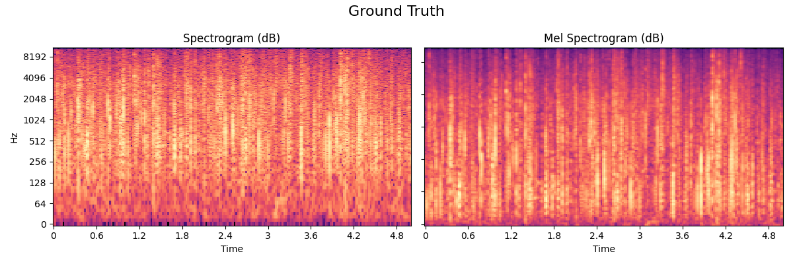
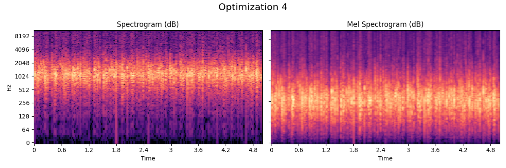
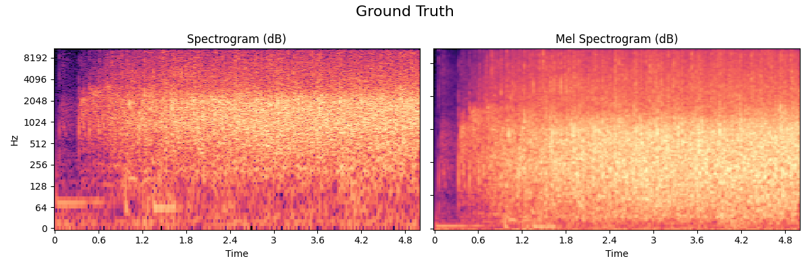

## Examples
In this page you will find the different examples and analysis of the best perceived optimization vs. the default synthetic sample and the recorded (ground truth sample).

The page of the procedural audio engine: [Nemisindo](https://nemisindo.com/). This engine gives the opportunity to create and mofidy the models in real time. Below we compare 3 samples, and show the difference between the top-5 important features with their changes. 

### Rain
The rain model used in Nemisindo is a mix between additive, modal physically informed and physical modelling. 
- **Ground Truth**  
The recorded sample:
  
  <audio controls>
  <source src="assets/audio/Rain3-24.wav" type="audio/wav">
  </audio>

- **Default (6KSFX)**  
The default model :
  .png)
  <audio controls>
  <source src="assets/audio/RainSynth3-25.wav" type="audio/wav">
  </audio>

- **Optimization**  
The best perceived model according to our subjective evaluation. 
Post production effects used: **Compression.**
We modified the parameters available like: **Ambient noise: 0.15, splatter: 0.96  and droplets: 0.5**

  
  <audio controls>
  <source src="assets/audio/RainOpt4-4.wav" type="audio/wav">
  </audio>

### Comparison of the features.

### Fire
The fire model used in Nemisindo is a mix between additive, modal, subtractive and physically informed synthesis. 

- **Ground Truth**  
The recorded sample:
  
  <audio controls>
    <source src="assets/audio/Fire4-16.wav" type="audio/wav">
    </audio>

- **Default (6KSFX)**  
The model without any post-production effect:
  .png)
  <audio controls>
    <source src="assets/audio/FireSynth6-17.wav" type="audio/wav">
    </audio>
- **Optimization**  
The best perceived model according to our subjective evaluation. 
Post production effects used: **Compression and we added more lapping and crackling with the parameters available in the procedural audio engine.**
  
  <audio controls>
  <source src="assets/audio/FireOpt4-4.wav" type="audio/wav">
  </audio>

### Applause
The applause model used in Nemisindo is an additive synthesis model.It is inspired by the Andrew Farnell work. 
- **Ground Truth**  
The recorded sample:
  
   <audio controls>
    <source src="assets/audio/Applause1-0.wav" type="audio/wav">
    </audio>
- **Default (6KSFX)**  
The model without any post-production effect.
  .png)
    <audio controls>
    <source src="assets/audio/ApplauseSynth4-1.wav" type="audio/wav">
    </audio>
- **Optimization**
The best perceived model according to our subjective evaluation. 
Post production effects used: **We modified the parameters of clapping rate and enthusiasm. We performed compression and distortion.**
  
  
  <audio controls>
  <source src="assets/audio/Applause-4.wav" type="audio/wav">
  </audio>
  
[back](./)
