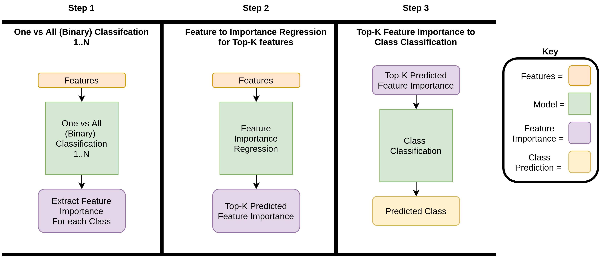
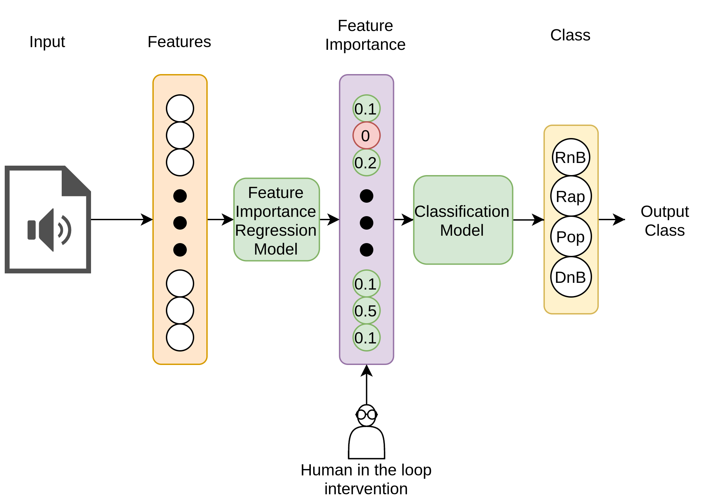

The perceptual quality of synthetic sound models remains a significant challenge for sound designers, primarily due to the lack of standardized objective evaluation methods and the limited availability of diverse synthetic samples. These limitations complicate the identification of perceptual deficiencies in synthesized audio. While classification models can effectively differentiate between real and synthetic sounds, gaining insight into the underlying decision-making process can reveal which acoustic features need refinement.

# FEATURE-DRIVEN BOTTLENECK FRAMEWORK FOR TREE-BASED
The model used in SOAP is comprised on the next image:

- **Step 1: One vs All Classification**

The feature importance states how much a feature impacts the decision-making of a model. To extract the feature importance for each class, $C$ models, where $C$ is the number of classes, are trained on one versus all (binary) classification tasks to ensure the model learns to effectively disambiguate between the target class and all the other classes. The models are trained to converge on a uniform dataset split to ensure that the feature importance is not biased to a particular classification. For each classifier $C$ we extract the top-K features required to classify based on global feature importance, these then form the concept labels for this class. 

- **Step 2: Top-K Feature Importance Bottleneck**

The second part of the feature-driven bottleneck framework is to predict each class's top-k feature importance. Therefore, instead of training a model to predict the class based on the input features, we train a model to predict the top-k feature importance for the particular class, using the softmax top-k feature importance for the associated class from step 1. 
- **Step 3: Top-k Feature Classification**

The third part of the feature-driven bottleneck framework takes the predictions from step 2 and trains a model to use the predicted top-k feature importance to predict the associated class. 

Step 2 and Step 3 are combined to create the overall predictive process, Figure \ref{overal_process}, which takes in features and then predicts the top-k features' importance, which is used as input to the class classification model. At test time, intervention can be made between steps 2 and 3, enabling feature importance error correction, which can hypothetically enable near-perfect accuracy, as shown in Figure \ref{process}. Human intervention is a core contribution, and, as far as we are aware, the first attempt to offer a bridge between machine learning and a human expert in audio classification.

# Sound categories

The SOAP paper was performed in 30 sound categories. All the synthetic models are listed [here](https://docs.google.com/spreadsheets/d/1KNiRQdd2AxuzoDDhtLKynx-YiRtXolz7Cmi_yLuYXLk/edit?usp=sharing). 

We retrieved the top 5 features after using the Bottleneck framework. All the top 5 features of the 30 categories can be found [here](https://docs.google.com/spreadsheets/d/1D9WmVtdcp3gVJVWvY20wZEMUg0LAxOCs-plfeZjsb-M/edit?usp=sharing). 

| Sound category     | Feature 1    | Feature 2         | Feature 3        | Feature 4         | Feature 5          | Classification        |
|:-------------|:-------------------|:------------------|:------------------|:------------------|:------------------|:------------------|:---------------------------|
| Applause     | Pitch salience      | pitchconfidence   | Attack start       | Dynamic complexity     | Amplitude 5        | Temporal and spectral  |
| Applause     | Pitch confidence    | MFCC 3           | Amplitude 3        | Frequency 1        | MFCC 6           | Temporal and spectral  |
| Church Bells | Amplitude 2         | Amplitude 4       | Pitch salience     | Amplitude1        | Max to total        | Temporal and perceptual |
| Church Bells | Pitch salience      | Spectral flux      | Dynamic complexity     | Crest             | MFCC 3            | Temporal and perceptual |
| Bubbles      | Log attack time      | Spectral flatnesss | mfcc_1            | LDB               | Intensity         | Temporal and spectral  |
| Bubbles      | Crest              | Effective duration | frequency1        | pitchconfidence   | Attack start       | Temporal, perceptual and spectral |
| Droplets     | Loudness           | Effective duration | LDB              | RMS              | MFCC 1           | Temporal and spectral  |
| Droplets     | Loudness           | RMS          | LDB             | Median            | Spectral flux      | Temporal and spectral  |

# Optimization
For the optimization, we provide the whole list of both sound categories, top 5 important features and the optimizations made for the subjective test. 
All the optimization parameters vary depending on the model used in the procedural audio online engine:[Nemisindo](https://www.nemisindo.com)

* The .zip file can be downloaded here: [Dataset](https://drive.google.com/file/d/1f5xf9ZPqKKl-iOVH5jyJUJ8wKT4LzMnP/view?usp=share_link)

| Class          | Optimization 1                                                | Optimization 2                                                        | Optimization 3                                                     | Optimization 4                                                     |
|:---------------|:---------------------------------------------------------------|:----------------------------------------------------------------------|:-------------------------------------------------------------------|:-------------------------------------------------------------------|
| Applause       | EQ and reverb                                                   | Distortion tone, more audience factor, and a distortion change of the knee | Change in the audience size, mix width, and distortion             | More clapping rate and enthusiasm. Use of compressor and distortion (with a change in the knee) |
| Applause       | EQ (high pass filter), Reverb and bell pitch 3.81               | Distortion Bell pitch 3.81                                              | Distortion plus changes in the source and energy                   | Low pass filter and compressor                                     |
| Church Bells   | EQ High band frequencies (600-1000), Reverb (Small Impulse)     | Change in centre frequency 1140, Reverb (Small Impulse)                | Optimization 1, distortion, changes in the source and energy       | Optimization 3 plus High pass filter (EQ) on frequencies           |
| Church Bells   | Surface wetness and viscosity                                   | Compressor                                                             | Compressor plus flow amount                                        | Distortion                                                         |
| Bubbles        | EQ and reverb                                                    | Distortion tone, audience factor, and distortion change of the knee    | Change in audience size, mix width, and distortion                 | Changes in clapping rate and enthusiasm. Use of compressor and distortion (change in the knee) |
| Bubbles        | High frequencies, Reverb and bell pitch 3.81                    | Distortion Bell pitch 3.81                                              | Distortion plus changes in the source and energy                   | Low pass filter and compressor                                     |
| Droplets       | EQ High band frequencies (600-1000), Reverb (Small Impulse)     | Change in centre frequency 1140, Reverb (Small Impulse)                | Optimization 1 plus Distortion, source and energy                  | Optimization 3 plus EQ on high frequencies                         |
| Droplets       | Surface wetness and viscosity changes                           | Compressor                                                             | Compressor plus changes on the flow amount                         | Distortion                                                         |

For the whole list of all the modifications based on the top 5 features in the synthesis models, we used the post production effects and the parameters available in the online tool. 

Here, we share a spreadsheet with  the different parameter changes for our optimization samples, as seen in the table above you'll find the following:
*   Sound category
*   Optimization characteristics (Opt 1, Opt 2, Opt 3, Opt 4. )
You can find all the changes of the samples in the 
[Link to the full list of optimizations ](https://docs.google.com/spreadsheets/d/1yg0VtcU-2Eo1-I1Io8vB-8VSBgrAsxN4SJoMKOjoBSE/edit?usp=sharing)

We show the difference in the top-5 categories with plot bars in the Applause category below: 

We can see that Pitch confidence was one of the most important features and could be the reason why it is perceived as more "real". 

# Analysis
In this section you will find the samples used in the subjective evaluation for SAOP, 
[Examples](./another-page.html).

